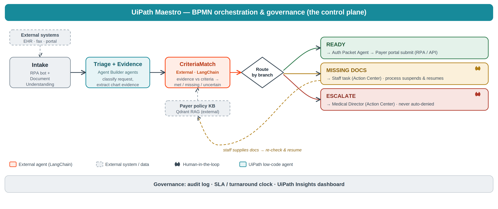

# AuthFlow AI

**Governed, human-in-the-loop prior authorization, orchestrated end to end on UiPath.**

UiPath AgentHack 2026 · Track 2 (Maestro BPMN)

---

## 1. Overview

Prior authorization is one of healthcare's most expensive bottlenecks. A clinician requests a procedure, and the request enters a slow, manual review against a payer's medical-necessity policy. Staff chase missing documentation, reviewers re-read the same notes, and genuinely borderline cases wait in the same queue as clean approvals. It is slow, costly, and error-prone, and the decisions matter.

**AuthFlow AI** models this as a governed, long-running business process on UiPath Maestro. An AI agent (CriteriaMatch) reads the clinical record against the payer's policy and judges each medical-necessity criterion. A BPMN process then routes the request down one of three paths based on that judgment, automatically approving clean cases, pausing for a human when documentation is missing, and escalating guideline-discordant requests to a clinician.

The guiding principle: **agents accelerate the work; clinicians keep the decisions.** The agent never auto-denies. It approves the clear-cut cases, surfaces exactly what is missing, and routes anything ambiguous to a person, with a full audit trail and citations to policy.

The headline scenario is elective peripheral arterial stenting for intermittent claudication, a real procedure with a well-defined medical-necessity policy.

## 2. How it works (architecture)





AuthFlow is a UiPath Maestro **BPMN 2.0** process that orchestrates an AI agent, a decision gateway, and human tasks.

```
Start → Ingest → Extract → Triage → CriteriaMatch (AI agent) → Route by branch (gateway)
                                                                      │
                          ┌───────────────────────────────────────────┼───────────────────────────────────────┐
                          ▼                                            ▼                                       ▼
                   branch = "ready"                           branch = "missing_docs"                  branch = "escalate"
                          │                                            │                                       │
                  Generate packet                          Human task (Action Center):              Human task (Action Center):
                          │                                "Documentation required"                 "Medical Director review"
                    Submit to payer                                    │                                       │
                          │                              staff completes → record updated            clinician decides
                         End                                           │                                       │
                                                          loops back to CriteriaMatch                         End
                                                          (re-evaluates → ready) → End
```

**The CriteriaMatch agent.** A LangChain coded agent running natively inside UiPath. It judges each policy criterion as `met`, `not_met`, `missing`, or `uncertain`, with evidence, rationale, confidence, and a citation to the policy text. A deterministic routing layer (not the LLM) then maps those judgments to a branch, so the routing decision is auditable and reproducible rather than left to the model. Inapplicable criteria (for example, smoking-cessation counseling for a lifelong non-smoker) are handled explicitly so they do not trigger false escalations.

**The three branches.**

- **`ready`** — all criteria met with complete documentation. The process generates the submission packet and submits, no human needed.
- **`missing_docs`** — documentation is incomplete or ambiguous. The process **suspends** and creates an Action Center task for staff. When the staff member provides the documentation and completes the task, the process **resumes**, re-evaluates the now-complete record, and proceeds to approval. This suspend/resume loop is the centerpiece: the process survives the interruption and keeps a human in the loop.
- **`escalate`** — the request is guideline-discordant (for example, a stent requested to speed return to recreational running, with no qualifying disease or therapy). It is **never auto-denied**; it routes to a Medical Director review human task for a clinical decision.

**Governance.** Every run captures the agent's per-criterion judgments, confidence, and policy citations. The deterministic routing layer means the same inputs always produce the same branch. Humans hold the decision at every point where the agent is uncertain or the request is discordant.

## 3. Tech stack

- **UiPath Maestro (BPMN 2.0)** — process orchestration, the gateway, and the suspend/resume human tasks
- **UiPath Action Center** — human-in-the-loop tasks (documentation request, Medical Director review)
- **UiPath coded agent** (`uipath-langchain`) — the CriteriaMatch agent, published to the tenant and invoked by the process
- **LangChain / LangGraph** — the agent framework
- **UiPath LLM Gateway** — model access with no external API key (model: `gpt-4.1-mini`)
- **Python 3.11**, Pydantic schemas for structured agent output
- Runs on **UiPath Automation Cloud**

## 4. Repository structure & how to run

```
authflow-ai/
├── criteriamatch/                 # the validated CriteriaMatch agent (schema, prompts, routing, evals)
├── criteriamatch-agent/           # the agent packaged as a native UiPath coded agent (deployed)
├── uipath/                        # Maestro BPMN process + agent exports
├── data/policies/                 # the mock payer medical-necessity policy
├── evals/                         # synthetic clinical cases + notes used to validate routing
├── schemas/                       # JSON schema for the agent's structured output
├── docs/                          # architecture diagram, evidence files, coding-agent log, deck
├── app/                           # companion Clinica AI web app (optional UI; not the core submission)
└── mocks/
```

**Validate the agent locally:**

```bash
cd criteriamatch
pip install -r requirements.txt
python -m criteriamatch.eval        # runs the three synthetic cases through the routing logic
```

**Run the agent on UiPath (coded agent):**

```bash
cd criteriamatch-agent
uipath auth --staging
uipath run agent --file input_case2.json    # runs against the UiPath LLM Gateway, no API key
```

**Deploy & orchestrate:**

1. `uipath pack` and `uipath publish` the agent to the **Orchestrator Tenant Processes Feed** (not personal workspace, so the Maestro process can resolve it at runtime).
2. Enable the **Actions** service on the tenant (Admin → Tenant → Add Services) and assign an Action Center license, required for the human tasks.
3. Open the Maestro process in `uipath/`, confirm the agent binding and the gateway conditions (`vars.routing.branch == "ready" | "missing_docs" | "escalate"`), and run.

## 5. Demo & results

All three branches were validated end to end on UiPath Automation Cloud. Execution evidence is in `docs/` (`evidence_case1_ready.txt`, `evidence_case2_missing_docs.txt`, `evidence_case3_escalate.txt`).

| Case | Clinical picture | Routed to | Outcome |
|------|------------------|-----------|---------|
| **Case 1** | Completed supervised exercise program, optimal medical therapy, qualifying disease | `ready` | Auto-approved → packet → submit → End |
| **Case 2** | Ambiguous conservative-therapy documentation | `missing_docs` | **Suspended → staff completes Action Center task → resumed → re-evaluated → approved → End** |
| **Case 3** | Mild disease, recreational goal, no therapy, active smoker | `escalate` | Medical Director review task → clinician decides → End |

**Case 2 is the centerpiece:** the agent flags the gap, the process pauses, a human supplies the documentation through Action Center, and the process resumes and approves on re-evaluation. This is "handles complexity, survives interruptions, keeps humans in the loop" running for real.

**Demo video:** [link to be added]

## Bonus: built with a coding agent

AuthFlow was built using a coding agent (Claude) throughout, for design, implementation, and live debugging on the UiPath platform.

**How it contributed:**

- Designed and implemented the two-layer CriteriaMatch agent (LLM judges each criterion; deterministic code derives the routing branch), making the routing auditable rather than model-dependent.
- Debugged real platform integration issues live: staging authentication, publishing the agent to the correct tenant feed so the process could resolve it at runtime, fixing a routing bug where the model marked an inapplicable criterion as `not_met`, and diagnosing the Action Center provisioning gap (`AppTasks NotFound`) down to a missing tenant service and license.
- Wired the BPMN process: input/output mappings, gateway conditions, and the suspend/resume loop including the variable update that lets the re-evaluation resolve.

**Verifiable evidence:** `docs/coding-agent-log.md` is a dated, session-by-session engineering log of the build, including the problems hit and how they were solved. Per-case execution evidence is in `docs/evidence_case*.txt`, and screenshots of the working suspend/resume run are included with the submission.

## License

MIT, see [LICENSE](LICENSE).
